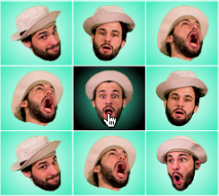

# Click On Jorge



Perhaps the best game ever invented, 'Click On Jorge' is the opportunity to continually click on the most handsome man in the world. In 20 seconds, try to click on my face as many times as possible and get a your name in the high scores. It hurts my face, but it's worth it.

## Setup

First, install all node modules:

```
npm install 
```

To build all less, js, and copy assets:

```
grunt build
```

## Depdencies

- Timbre.js
- jQuery.js
- jQuery-touchpunch.min.js
- less.js

## Class Structure

- Game Class - Controls score, game timing, etc.
- Canvas Class(game_instance, sound_instance) - Controls user interaction with the canvas element
- Interface Class(game_instance) - Controls top menu, including all stats
- Sound Class - Controls all sounds through a timbre.js instance

footer.js orchestrates the interactions between these instances through event listeners, triggered on the document object. Every time I do this, it sounds a bit hacky, but it has always served me well. 